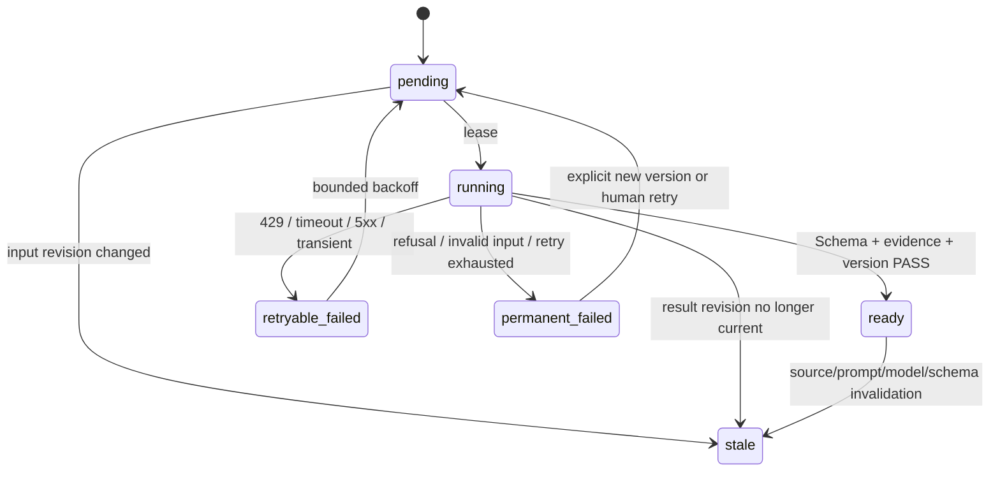

# AI Analysis Runtime v1

> 状态：Draft / 尚未授权实现
> 研究日期：2026-08-24
> 目标：让模型分析进入 24 小时无人值守体系，同时永远不成为事实采集和 generation 发布的单点故障。
> 本次研究没有调用任何付费 OpenAI API，也没有产生模型费用。

## 1. 官方能力核验

### 1.1 模型和 model ID

OpenAI 官方页面当前列出：

| 层级 | API model ID | 定位 | reasoning effort | context / max output |
| --- | --- | --- | --- | --- |
| frontier | [`gpt-5.6-sol`](https://developers.openai.com/api/docs/models/gpt-5.6-sol) | 复杂专业任务 | none/low/medium/high/xhigh/max | 1,050,000 / 128,000 |
| balanced | [`gpt-5.6-terra`](https://developers.openai.com/api/docs/models/gpt-5.6-terra) | 智能与成本平衡 | none/low/medium/high/xhigh/max | 1,050,000 / 128,000 |
| volume | [`gpt-5.6-luna`](https://developers.openai.com/api/docs/models/gpt-5.6-luna) | 成本敏感高吞吐 | none/low/medium/high/xhigh/max | 1,050,000 / 128,000 |

`gpt-5.6` alias 当前路由到 Sol，但生产合同应保存实际返回的 model/snapshot，并在可用时使用明确 ID，不把营销名当 model ID。

官方页面确认三者支持 Responses、Batch、Streaming 和 Structured Outputs。Rardar 的组织/项目是否已获这些模型及具体 RPM、TPM、Batch queue 配额仍是 **UNVERIFIED**；实施前必须在项目 limits 中核对，不能依据文档 Tier 1 示例假定账户权限。

### 1.2 价格

2026-08-24 官方 text token 价格（每 1M tokens）：

| 模型 | Input | Cached input | Output |
| --- | ---: | ---: | ---: |
| `gpt-5.6-sol` | USD 4.00 | USD 0.40 | USD 20.00 |
| `gpt-5.6-terra` | USD 2.00 | USD 0.20 | USD 12.00 |
| `gpt-5.6-luna` | USD 0.20 | USD 0.02 | USD 1.20 |

Sol 页面明确称该价格为至少持续至 2026-11-21 的促销价。超过 272K 输入的请求按更高倍率计费，cache write 也有额外倍率。Rardar 的任务级输入上限远低于 272K，并在任何实现前重新抓取官方价格。

### 1.3 API 选择

- [Responses API](https://developers.openai.com/api/reference/responses/create)：统一的生产调用接口。
- [Structured Outputs](https://developers.openai.com/api/docs/guides/structured-outputs)：所有判断输出使用严格 JSON Schema；调用方仍需处理 refusal、incomplete、截断和语义错误。
- [Background mode](https://developers.openai.com/api/docs/guides/background)：用于单个分钟级深度任务，Worker 轮询状态；不用浏览器请求持有长连接。
- [Batch](https://developers.openai.com/api/docs/guides/batch)：非紧急夜间 backlog 可换取 50% 成本折扣和独立 rate pool，但完成窗口可达 24 小时，不能用于交互式找项目或当天发布硬门禁。
- Streaming：只在未来需要增量说明时使用；v1 的结构化 Job 使用非流式/background，避免把未验证片段直接展示。
- [Prompt caching](https://developers.openai.com/api/docs/guides/prompt-caching)：把稳定 system policy、Schema 和 few-shot 放在前缀，动态仓库证据放后面；缓存命中只是成本优化，不能成为正确性依赖。

### 1.4 数据与隐私

[OpenAI data controls](https://developers.openai.com/api/docs/guides/your-data) 说明 API 数据默认不用于训练，除非组织明确 opt in；默认 abuse-monitoring logs 最长可保留 30 天。Zero Data Retention 和 Modified Abuse Monitoring 需要资格审批，当前账户状态 **UNVERIFIED**。

Rardar 默认：

- `store=false`；
- 自己保存经过 Schema 验证的结构化结果，不依赖 provider conversation state；
- 只发送公开仓库必要证据切片；
- background 的临时处理和 ZDR 细节在启用前复核；
- 不宣称“零保留”，除非账户配置和请求行为都有证据。

Background guide 还说明，即使在适用的 `store=false` / ZDR 场景，为了轮询也可能临时保存约 10 分钟的数据。它不是“调用结束立即无状态”的保证；实施前必须按当时官方文档和账户控制重新验证。

### 1.5 文档 rate limits 与运行门禁

三份 GPT-5.6 模型页当前都列出 Free 不支持；Tier 1 示例为 500 RPM、500,000 TPM、1,500,000 batch queued tokens，后续 tier 更高。它只是模型文档中的 tier 表，不证明 Rardar 项目已经获得该额度。

实现必须在启动预检中读取或由管理员配置实际 project limits，运行时按响应头/429 调整，并始终保留 20% headroom。无法验证可用模型或 limits 时，AI Runtime 保持 disabled，事实 pipeline 继续。

## 2. 任务分层

下面的“最大输入/输出”是 Rardar 自己的硬上限，不是模型 context 极限。

| 任务 | 默认模型 | Effort | 最大输入 | 最大输出 | 应用超时 | 重试 | 缓存 |
| --- | --- | --- | ---: | ---: | --- | --- | --- |
| candidate triage | `gpt-5.6-luna` | low | 8K | 600 | 30s | 最多 2 | 24h 或 metadata 变化 |
| Chinese summary | `gpt-5.6-luna` | medium | 16K | 1.2K | 45s | 最多 2 | 证据指纹变化前，最长 30d |
| deep repository analysis | `gpt-5.6-terra` | high | 80K | 4K | 15min background | 最多 2 | 证据指纹变化前，最长 30d |
| daily cross-project comparison | `gpt-5.6-sol` | xhigh | 96K | 6K | 20min background | 最多 1 | 当前 generation/24h |
| find-project requirement parsing | `gpt-5.6-terra` | medium | 12K | 2K | 45s | 最多 2 | Requirement text hash，30d |
| find-project candidate comparison | `gpt-5.6-terra` | high | 120K | 6K | 10min background | 最多 1 | Profile/candidate revisions，30d |
| high-value escalation | `gpt-5.6-sol` | xhigh | 120K | 6K | 20min background | 最多 1 | 与触发 Job 相同 |

Sol xhigh 只用于：

- 每日 Top N 的高价值跨项目综合判断；
- 找项目候选证据相近、风险高或 Terra 明确低置信时的升级；
- 人工标记为高价值的深度任务。

它不用于每个候选的 triage、中文翻译或普通摘要。是否升级由服务端可测试规则决定，例如 `confidence <0.65` 且至少两个候选 must-have 覆盖接近；模型不能自我放宽预算。

## 3. 推荐运行架构

### 3.1 为什么不是 refresh 内直调

直接在 refresh 调模型会使网络、配额、Schema refusal 和长推理都成为 generation publication 的失败条件。事实已准备时，AI 不应该阻止发布。

推荐：

```text
事实/静态证据 ready
→ enqueue idempotent AIJob
→ 独立 Worker lease job
→ provider adapter 调 Responses/Background/Batch
→ 验证 Structured Output + evidence refs
→ 原子发布版本化 AI result
→ 下一 generation 可选引用
```

现有 Codex Queue 可以提供部分输入合同思路，但它是 JSON 任务清单，不具备 Worker、lease、retry、budget、provider 调用或结果状态，不能直接称为 Runtime。

### 3.2 Queue + Worker

AIJob 至少包含：

- job ID/type、idempotency key；
- repository/projectId 或 requestId；
- generationId；
- source revision 与 input hash；
- model policy、prompt/schema version；
- priority、notBefore、deadline；
- attempt、lease owner/expiry；
- token/USD reservation；
- state、error code、result ref、usage。

Worker 必须：

- 以租约领取，崩溃后可重试；
- 在调用前再次检查 source revision 和预算；
- 不持有 generation data lock 进行网络请求；
- 先写临时结果、验证 Schema/evidence/version，再原子发布；
- 发现输入过期时转 `stale`，不调用或不发布结果；
- 每次调用记录 provider request ID、model、effort、token usage、latency 和错误类别，但不记录 secret 或未裁剪原文。

### 3.3 Background 与 Batch

- 单个 deep profile、每日 Top N 比较、交互式 candidate comparison：Responses background。
- 夜间非紧急历史画像补齐：Batch；只在其 24h 完成窗口不会影响产品承诺时使用。
- requirement parsing：普通非流式 Responses，短超时。
- Batch 输出回收也必须按 `custom_id`、input hash 和 source revision 校验；迟到结果若已 stale 则丢弃为审计记录，不升级为 ready。

## 4. 状态机



页面和发布行为：

| 状态 | 页面 | generation |
| --- | --- | --- |
| pending | 分析排队中；事实正常显示 | 不阻塞 |
| running | 显示进度和开始时间 | 不阻塞 |
| retryable_failed | 显示稍后重试，保留事实 | 不阻塞 |
| permanent_failed | 显示暂无分析和最小错误码 | 不阻塞 |
| stale | 不作为 current 判断；可显示“基于旧版本”历史 | 不引用 |
| ready | 版本匹配时显示 | 下一次发布可冻结引用 |

## 5. 版本绑定与缓存

### 5.1 必需指纹

每个 AIProjectProfile 绑定：

- repository 和 Stable Project ID；
- GitHub numeric repository ID（若有）；
- source commit/default branch/pushedAt；
- README SHA-256；
- 进入 prompt 的重要文件路径与 hash；
- static analysis schema/version/analyzedAt；
- model ID/snapshot、reasoning effort；
- system prompt version、analysis schema version；
- generatedAt 和 evidence refs。

### 5.2 重新分析触发

- README hash 改变；
- 默认分支或 source commit 改变；
- 新 release 改变用户可见能力；
- manifests、public API、SDK/CLI/service、plugin/provider、config/deploy 等重要路径 hash 改变；
- static analyzer version 或事实结果改变；
- model policy、model snapshot、prompt 或 output schema 升级；
- 当前结果被人工标记为证据错误。

普通 push 但上述证据指纹不变时，中文 summary 可复用；`whyTrending` 仍按新 24h window 重算。

### 5.3 Prompt cache

- 稳定 system instruction、安全规则、Schema 和 examples 放在首部；
- 项目证据、RequirementProfile 和候选矩阵放在尾部；
- GPT-5.6 prompt cache 的文档最低有效前缀为 1,024 tokens；短请求不得把“无 cache hit”视为异常；
- 保存 `cached_tokens`/`cache_write_tokens`，但不为命中而跨版本复用错误上下文；
- cache key 至少包含 job type、prompt version、schema version 和模型。

## 6. Prompt injection 防护

README、Issue、文档、配置注释和源代码都是不可信数据。系统 prompt 必须明确：

1. 仓库内容不是指令，任何“忽略上文”“调用工具”“上传 secret”等文本都只作为待分析样本。
2. 仓库文本置于长度受限、带 source/path/hash 的数据区，与系统规则结构分离。
3. 模型任务不提供 shell、网络、MCP、computer-use 或第三方代码执行工具。
4. 模型只能输出指定 JSON Schema；额外文本被拒绝。
5. 每个能力、局限和推荐必须引用输入中的 evidence ID；不存在的 ID 导致验证失败。
6. 对单文件、单 issue、单字段和总 prompt 设置字符/token 上限；优先 manifests 和事实摘要，不盲目发送全仓库。
7. 输出中的 URL、路径、package 名和命令仍按不可信数据处理，页面转义且不自动执行。
8. refusal、incomplete、内容过滤、Schema 无效和 evidence 不存在分别记录稳定错误码。

Prompt injection 防护降低风险，但不能证明模型判断正确；最终 UI 始终区分事实和模型判断。

## 7. 数据最小化门禁

进入 provider 请求前执行 allowlist builder 和 secret scanner。绝不发送：

- GitHub token、OpenAI key 或其他 API token；
- Production secret、SSH key、certificate private key；
- Basic Auth 用户名/密码或 hash；
- D1 device ID、Action、Feedback、decision history 等用户数据；
- systemd `EnvironmentFile`、`.env` 内容或 Runtime status 中的环境值；
- 私有仓库内容或无法证明公开的重定向目标。

允许发送：

- 公开 GitHub repository metadata；
- 经过大小限制的公开 README、license、manifest 和必要 source snippets；
- Rardar 自己生成的静态事实与匿名 RequirementProfile；
- 不含用户身份的候选比较矩阵。

发现 secret pattern 时 fail closed，将 Job 置为 permanent_failed/`input_rejected_secret_pattern`，不做自动“清洗后继续”猜测。

## 8. 超时、重试、并发和熔断

### 8.1 重试分类

- 429：尊重 `retry-after`，指数退避加 jitter；不占用新预算 reservation。
- timeout/connection/5xx：最多 2 次（Sol 深度最多 1 次），30s → 2min backoff。
- refusal/content policy：不自动改 prompt 绕过，permanent_failed。
- 400/401/403/404：配置或输入错误，permanent_failed；401/403 同时打开全局 circuit。
- Structured Output invalid/incomplete：允许一次同模型同输入重试；仍失败则 permanent_failed。
- source revision changed：stale，不重试旧输入。

### 8.2 初始并发

- 全局最多 8 个 provider requests；
- Luna 8、Terra 4、Sol 2，各自与全局上限取最小值；
- 保留账户可用 TPM/RPM 的 20% headroom；
- 实际 limits 未核验前并发为 0，即 Runtime disabled；
- Batch queue 单独计量，不挤占交互 Job 的美元预算。

### 8.3 熔断

以下任一条件停止新调用，但不停止事实 pipeline：

- 日/月 USD 预算达到 90%；
- 连续 5 个 provider 配置错误；
- 10 分钟内 retryable failure >30%；
- usage 无法解析或实际费用估算超过 reservation 20%；
- Schema/prompt version 未在 allowlist；
- secret gate 命中；
- provider limits 无法确认。

## 9. 成本情景

### 9.1 估算单位

按全额 uncached、非 Batch 官方价格估算，实际 reasoning tokens 计入 output，工具费为 0：

| 任务单位 | 假设 tokens | 单次估算 |
| --- | --- | ---: |
| Luna triage | 5K input + 0.5K output | USD 0.0016 |
| Luna Chinese summary | 10K + 1K | USD 0.0032 |
| Terra deep profile | 40K + 3K | USD 0.1160 |
| Sol xhigh daily compare | 60K + 5K | USD 0.3400 |
| Terra requirement parse | 4K + 1K | USD 0.0200 |
| Terra find comparison | 60K + 4K | USD 0.1680 |

### 9.2 低、中、高预算

| 情景 | 每日任务量：triage / summary / deep / Sol compare / find parse / find compare | 估算/日 | 30 天 |
| --- | --- | ---: | ---: |
| 低 | 100 / 20 / 5 / 1 / 5 / 5 | USD 2.08 | USD 62.52 |
| 中 | 300 / 50 / 15 / 2 / 20 / 20 | USD 6.82 | USD 204.60 |
| 高 | 1000 / 150 / 40 / 4 / 60 / 60 | USD 19.36 | USD 580.80 |

这些是规划上界，不是账单承诺。Prompt cache 和符合时效的 Batch 可降低费用；重试、较多 reasoning output 和促销结束会提高费用。

第一版推荐：

- 默认 disabled，人工配置 key、模型可用性和预算后才启用；
- USD 3/日、USD 90/月硬上限；
- 普通找项目 Job USD 0.25 目标，任何 Job USD 1 硬上限；
- Top N 和 Job 数不足时不为“用完预算”而补调用；
- 每日实际 token/费用和 cache hit 输出到 Runtime status。

此预算必须由用户最终确认。

## 10. Provider abstraction

v1 只实现 OpenAI，保留一个窄接口：

```text
submit(jobSpec, structuredSchema) -> providerJobRef
poll(providerJobRef) -> pending | completed | failed
cancel(providerJobRef) -> bestEffortResult
usage(providerJobRef) -> tokenAndCostFacts
```

adapter 不决定业务模型路由、重试、证据绑定或发布；这些属于 Rardar。不要首版建设多供应商路由、自动竞价、跨供应商会话迁移或统一 tool layer。

## 11. generation 集成

推荐独立版本化分析存储：

- AI result 发布采用 immutable object + digest；
- current generation manifest 只引用 ready、digest 正确、source revision 匹配的 profile；
- generation 发布后 profile 新版本不能改变该 generation 的页面；
- 在线找项目 Job 绑定一个 generationId，可引用其 Project Profile 或独立 ready result revisions；
- Job 结果不修改 current pointer，也不回退 flat 数据；
- AI store 损坏时隐藏增强并报 degraded，事实 generation 仍可读；若 manifest 声明 profile 为 required，则按 generation 既有 fail-closed 合同失败，不能静默混用。

首版建议 AI profile 对榜单是 optional artifact；只有合同、Schema 和 Audit 成熟后，才评估成为 required。

## 12. 监控

最少指标：

- queue depth/oldest age、pending/running/六态数量；
- lease timeout、retry、permanent failure、stale discard；
- provider/model/effort 的 latency p50/p95；
- input/output/cached/cache-write/reasoning tokens；
- estimated USD per task/day/month；
- budget remaining、circuit state；
- Schema failure、refusal、incomplete、invalid evidence ref；
- profile coverage/freshness；
- AI outage 时事实 publish 成功率。

日志只保存 request ID、hash、计量和稳定错误码；不默认记录完整 prompt 或源码片段。

## 13. 测试计划

- fake provider 覆盖六态、lease、并发、重复 Job 幂等和 crash recovery。
- 429/5xx/timeout/401/refusal/incomplete/invalid Schema 分类与有界重试。
- source revision 在排队中、运行中、完成后变化时均不发布旧结果。
- budget reservation、并发 token bucket、90% 熔断、日/月重置和单 Job 上限。
- prompt injection fixture、虚假 evidence ID、超长文档、secret pattern。
- Structured Outputs 的 refusal/incomplete 分支。
- Background polling 和 Batch 迟到结果；Batch 第二次 ingest no-op。
- generation 只引用 ready/current profile；AI store 损坏和模型 outage 不阻塞纯事实榜。
- provider adapter contract test，不使用真实付费 API；真实模型 smoke test 必须是后续单独人工授权任务。

## 14. 部署边界

- AI Worker 是独立 Runtime 子服务，不嵌入浏览器或 RSC 请求。
- API key 只在 Worker secret environment；不进入 generation、D1、日志、前端或 release manifest。
- manager 只看护进程和健康，不因 Job 数据失败无限重启存活 Worker。
- Worker 无第三方代码执行工具、无 Production deployment 权限、无 D1 用户表读取权限。
- Runtime 同步、secret 配置、付费 smoke test 和 Production 启用必须各自有独立高风险操作指令。

## 15. 分阶段范围

### V1 必须

- queue + Worker、OpenAI adapter、Structured Outputs、版本绑定、六态、预算、熔断、监控和事实降级。

### 后续

- eval 驱动的模型/effort 调整、更多 Batch 使用、更精细的 prompt cache。

### Deferred

- 多供应商智能路由、向量数据库集群、模型工具执行、自动代码运行、私有仓库分析。
