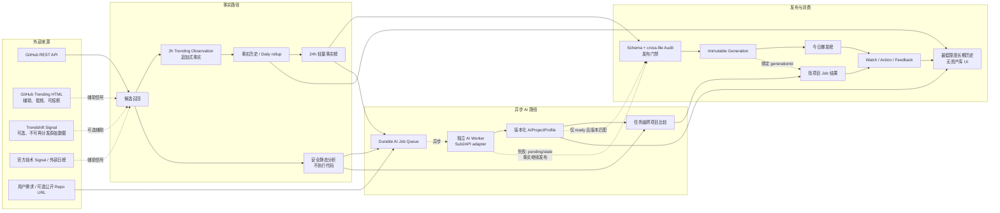

# Rardar v2 产品与架构 RFC

> 状态：产品与架构合同已接受 / 尚未授权实现
> 研究日期：2026-08-24
> 范围：今日爆发榜 v2、找项目 v2、AI Analysis Runtime v1
> 非授权声明：本文不是实现批准，不表示任何功能已经开始或完成。

## 1. 执行摘要

Rardar v2 应把两个不同问题明确拆开：

1. **今日爆发榜 v2**回答“过去 24 小时，GitHub 上哪些项目获得了最多新增 Star”。主榜只按 Rardar 自有、连续、可审计的 Star 快照差值排序。GitHub Trending、Trendshift 和外部日榜只负责候选召回与交叉验证，不能覆盖客观名次。
2. **找项目 v2**回答“为了完成一个具体任务，哪些项目适合整套采用、模块复用、Provider 接入或架构参考”。它不再局限于当前 Catalog，也不再依赖八组固定关键词，而是采用需求结构化、动态 GitHub 召回、静态证据验证和同任务跨项目比较。
3. **AI Analysis Runtime v1**是两者共享的异步判断层。事实采集和榜单发布不依赖模型成功；所有模型结果必须绑定仓库证据版本、模型和 prompt，并通过结构化合同进入产品。

推荐从事实链开始，而不是先建设通用 AI 平台：

```text
Trending 事实观察
→ audited 24h artifact
→ 最小 AI Runtime（默认 disabled）
→ 今日爆发榜 UI
→ 中文增强
→ 找项目 v2
```

这条路线最快产生用户可见价值，也最容易逐 PR 验证和回滚。

## 2. 产品定位

Rardar 不是“又一个 GitHub 热门项目列表”。它应形成从发现到行动的两条入口：

- **客观发现入口**：用可复核的 24h Star 增长减少“今天发生了什么”的信息差。
- **任务决策入口**：用需求、证据和比较减少“是否已经有人实现、应该复用什么”的信息差。

两者共享 Project Profile 和证据基础，但不共享排序语义：热榜排名是事实；任务匹配是针对当前需求的模型判断。它们最终都服务于 North Star——用户每周对多少个项目采取了真实行动，而不是单纯提升浏览量。

数据页面的正式覆盖文案是：

> 基于 Rardar 多源候选召回与自有连续观察形成的 GitHub 24h 爆发榜。

“全网现在最值得关注什么”只能作为产品目标。Rardar 不得声称已经扫描全 GitHub、当前榜等于 GitHub 绝对全站 Top 20，或所有爆发项目都必然被召回。页面必须展示或可查看候选来源、成功查询数、召回候选数、观察覆盖状态、数据更新时间和 degraded source。

### 2.1 三个模块的关系

| 模块 | 核心输入 | 核心输出 | 权威边界 |
| --- | --- | --- | --- |
| 今日爆发榜 v2 | 连续 Star 快照、外部候选信号 | 客观 24h 排名、待验证新入榜 | 排名只由自有事实计算 |
| 找项目 v2 | 自然语言需求；可选公开 GitHub URL | 3–5 个可复用候选与横向比较 | 判断必须引用当前证据 |
| AI Runtime v1 | 版本化事实与静态证据 | 中文画像、原因说明、任务比较 | 可失败、可过期、不可改事实 |

高价值资产库本阶段只积累最低限度历史，不设计页面、分类导航、专属评分或自动晋升。

## 3. 已接受决策与实施前未知项

### 3.1 已接受

- 首页精确 Top 5、完整页精确 Top 20；主排序只使用 `observedStarDelta DESC`，同分依次使用 `totalStars DESC`、`repository ASC`。
- 每 2 小时只运行轻量 observation；每日 08:00（Asia/Shanghai）审计并正式发布。
- 首次发现立即进入独立“新入榜待验证”区，显示实际观察窗口；取得完整 24h 基线前不进入精确榜。
- AI 可以生成中文简介、核心能力和“AI 爆发原因判断”，但不能修改、过滤、插入或补齐客观名次。
- 找项目 v2 同时支持纯自然语言需求，以及需求加一个公开 GitHub 仓库 URL。
- 原始需求和 RequirementProfile 默认保留 30 天；长期个性化必须由用户显式 opt-in。
- 复用结果固定为 `whole_product`、`module_or_library`、`provider_or_connector`、`workflow`、`reference_only`、`not_recommended`；参考细类放入 `referenceKinds`。
- Trendshift 仅为可关闭的辅助召回与交叉信号，不是事实权威或 publication gate，且不得公开再分发其完整原始 API 数据。
- GitHub numeric repository ID 仅作为 observation ledger 的 rename/transfer 连续性锚；现有 Stable Project ID 继续负责 Catalog、路由、D1、Action 和 Feedback。
- 第一版 AI Provider 是自托管 Sub2API，Primary model 是 `gpt-5.6-sol`；普通任务使用 medium/high，深度分析、跨项目比较和高风险复核使用 xhigh。
- 第一版不要求 Luna/Terra/Sol 多模型路由，不设置固定货币硬预算；仍强制限制并发、Job 输入/输出、timeout、重试、backlog、幂等和熔断。
- Rardar 自己拥有 durable AIJob queue 和独立 Worker；Provider Background/Batch/prompt cache 只作为可选优化，Streaming Deferred。
- 模型不可用时，事实榜和 generation publication 仍继续；所有公开仓库形态均可进入候选，非软件仓库必须被正确描述；不执行用户或第三方仓库代码。
- 高价值资产库完整产品建设 Deferred，只积累最低限度历史事实。

### 3.2 仅实施前才能验证

1. Sub2API exact capability probe 结果；
2. 实际 API 权限与 rate limits；
3. Structured Outputs 是否透传，或是否使用本地 Schema validation fallback；
4. canonical endpoint join；
5. Sub2API implementation/fork、exact version/commit、部署日期和安全状态；
6. AI Worker 最终 systemd 资源值；
7. 真实调用 latency 与 token usage。

这些不是尚未决定的产品方向，也不能在 capability probe 前被写成已验证事实。

## 4. 现状审计

### 4.1 当前事实

- `pipeline/collect_github.py` 通过 9 条 GitHub Search 查询召回候选，每条最多 30 个，按当前总 Star 排序；它不是全站 24h 增长扫描。
- 首次观察项目目前以 `stars / age_days` 作为速度代理；后续快照只比较任意两个采集时点，并把区间增量归一到 24h 用于内部评分。两者都不能称为精确 24h 新增 Star。
- `pipeline/build_catalog.py` 的 Daily Five 是最多 3 个近期动量项目加 2 个长期高热项目，按 `attentionScore`、工程准备度和总 Star 等混合排序，不是客观爆发榜。
- `SearchWorkbench.tsx` 只在当前、通常不超过 30 个项目的 Catalog 中，以 8 组固定关键词规则重排；没有动态 GitHub Search、需求结构化或跨项目比较。
- `pipeline/codex_queue.py` 只生成版本化任务 JSON；它没有调用模型、调度重试或消费队列，因此不是无人值守 AI Worker。
- `pipeline/analyze_repository.py` 能在严格大小、路径和超时边界内浅克隆或下载公开源码，并证明 README、许可证、测试目录、CI、容器、依赖锁、示例、文档等**文件事实**。它不能证明接口可用、测试通过、部署成功、模块可拆分、集成成本或安全性。
- 个性化反馈只调整个人相关性和重复曝光；它不应也不会改变全局事实。
- 页面每次请求由 `app/server-data.ts` 加载一个已验证 generation，这个一致性边界应继续保留。

### 4.2 可直接复用

- GitHub REST 客户端、限流错误处理和现有 9 条召回查询，可作为候选池的一部分。
- Stable Project ID、repository normalization 和 generation 原子发布。
- 安全静态取证器及其大小、路径、symlink、archive 和超时门禁。
- Schema、Audit、source-version binding 和 enrichment ingest 模式。
- Action Event、State、Feedback 和 Weekly Acted Projects。
- 单请求单 generation 的 published-data loader。

### 4.3 应废弃或降级的假设

- 废弃“`stars / age` 可代表 24h 增长”。
- 废弃“任意间隔快照归一化后即可标为精确 24h”。
- 降级现有 Daily Five 为兼容的“综合关注”视图；不得继续占据首页第一主榜。
- 废弃“当前 30 个 Catalog 足以回答任意找项目需求”。
- 降级 8 组固定规则为无模型时的 query hint，不再作为匹配权威。
- 废弃“文件存在即证明可复用模块”的推断。
- 废弃“Codex Queue 已经构成自动 AI Runtime”的表述。

## 5. 边界决策登记

以下每项都给出备选、推荐、理由、风险和人工确认状态。详细行为见三个专题 RFC。

### 5.1 今日爆发榜

| 问题 | 可选方案 | 已接受方案 | 理由 | 主要风险 | 状态 |
| --- | --- | --- | --- | --- | --- |
| 24h 权威 | 自有快照 / GitHub Trending / Trendshift / 外部日榜 | 自有连续快照唯一权威；其余仅召回与佐证 | 可审计、可重复、无供应商排序黑盒 | 冷启动覆盖不足 | 已接受 |
| 首次发现 | 不入榜 / 直接用外部值 / 单列 | 立即进入“新入榜待验证”，保留实际观察窗口与外部 reported 值/来源 | 不伪造 24h，又不漏掉新爆发 | 取得完整基线前不能进入精确榜 | 已接受 |
| 采集节奏 | 每日 / 4h / 2h / 混合 | 每 2h 轻量观察；每日 08:00 正式审计发布；重叠轮次记录 `skipped_overlap` | 固定相位能形成严格 24h 基线；单 owner 避免并发污染 | API 限流、漏跑 | 已接受 |
| 候选召回 | 9 queries / Trending / Trendshift / 外部榜 / Signal | Search + GitHub Trending（合规门禁）+ 现有外部信号；Trendshift 可选 | 多源召回，事实仍由 GitHub 元数据验证 | HTML 变化、第三方中断 | 已接受 |
| 去重 | repository 字符串 / Stable ID / external numeric ID | GitHub numeric repository ID 仅作为 observation 连续性锚；Stable Project ID 合同保持不变 | 支持 rename/transfer 观察连续性且不扩大身份迁移 | 未来长期身份统一需独立设计 | 已接受 |
| 榜单长度 | 5 / 10 / 20 / 全量 | 首页首屏 5，完整页 20；不以弱数据补满 | 保持决策密度并提供探索空间 | 首屏可能过少 | 已接受 |
| AI 失败 | 阻塞 / 复用旧分析 / 事实先发 | 事实先发；AI 显示 pending/stale，旧结果只在证据版本完全一致时复用 | 模型不是发布单点故障 | 页面短期缺少中文解释 | 已接受 |
| 异常处理 | 自动剔除 / 全量反作弊 / 标记 | v1 只做 fork/mirror/archive/disabled、source disagreement、异常增幅、首次发现、rename/transfer 标记 | 最小可解释防护，不误杀 | 无法识别复杂刷 Star | 已接受 |
| 首页字段 | 全部首屏 / 极简 / 分层 | 首屏：排名、24h、新总 Star、名称、中文一句话、事实置信/AI 状态；详情：外部名次、连续上榜、能力、AI 爆发原因判断、来源 | 首屏回答核心问题 | 解释信息需一次点击 | 已接受 |
| 五维评分 | 保留排序 / 隐藏 / 详情 / 改名 / 废弃 | 不参与榜单；Engineering Readiness 移至详情，Reuse Fit 只用于找项目，Evidence Completeness 只说明置信/覆盖；Attention 改称“综合关注”，Endurance 进入长期趋势 | 避免分数覆盖事实 | 旧用户会看到语义变化 | 已接受 |

### 5.2 AI Runtime Foundation

| 问题 | 可选方案 | 已接受方案 | 理由 | 主要风险 | 状态 |
| --- | --- | --- | --- | --- | --- |
| Provider | OpenAI direct / Sub2API / 多供应商 | 自托管 Sub2API；预期 base URL 标识 `https://api.cosflow.icu`，exact join 由 Probe 决定 | 复用用户自托管入口，同时保留明确适配层 | 代理能力与安全状态尚未验证 | 已接受，能力待 Probe |
| 模型策略 | 全部 xhigh / 单模型多 effort / 多模型分层 | `gpt-5.6-sol` 单模型；普通任务 medium/high，深度分析、横向比较和高风险复核 xhigh | 架构简单，effort 与任务价值匹配 | 真实 latency/usage 待测 | 已接受 |
| 执行方式 | refresh 内直调 / Rardar queue+Worker / Provider Background/Batch | Rardar-owned durable queue + 独立 Worker；普通完整非流式请求是最低路径，Background/Batch 仅可选优化 | 不阻塞 generation，Provider 无异步能力也能运行 | 新增独立运行组件 | 已接受 |
| 结果绑定 | 只绑 repository / 只绑时间 / 完整证据指纹 | repository、projectId、commit/pushedAt、README hash、static version、模型、effort、prompt、schema、generatedAt 全绑定 | 阻止陈旧解释错配 | 缓存命中降低 | 已接受 |
| 重分析触发 | 固定 TTL / 任意 push / 证据变化 | README/default branch/release/重要目录/静态分析、模型、prompt、schema 任一变化 | 只在判断依据变化时调用 | 重要目录定义不全 | 已接受 |
| 状态机 | 成败二态 / 六态 | pending/running/retryable_failed/permanent_failed/stale/ready | 页面和重试行为明确 | 状态迁移实现复杂度 | 已接受 |
| 调用边界 | 不限 / 金额上限 / operational guardrails | 暂不设货币硬预算；强制 concurrency=1、单 Job 输入/输出/timeout/retry、backlog=500、幂等、usage accounting 和连续错误熔断 | 不把金额当启用门槛，同时防止无限调用 | 真实成本需从 usage 观察 | 已接受 |
| Structured result | 自由文本 / Provider Schema / 本地校验 | Probe 后选择 NATIVE 或 LOCAL_SCHEMA_VALIDATION_FALLBACK；两者都执行本地 JSON/Schema/evidence/source-version validation | Provider 能力不成为正确性单点 | fallback 输出无原生约束 | 已接受 |
| Prompt injection | 信任 README / 文本过滤 / 不可信数据边界 | 仓库文本永远是带边界的不可信数据，禁工具执行、证据引用和长度限制 | 最直接压缩攻击面 | 模型仍可能误判 | 已接受 |
| 数据最小化 | 发送全仓库 / 摘要 / 必要证据切片 | 仅公开仓库必要切片；绝不发送 token、Production secret、D1 用户数据、Basic Auth、EnvironmentFile | 降低泄漏面与成本 | 证据不足时质量下降 | 已接受 |
| 供应商抽象 | Provider 写死 / 通用路由平台 / 极小 adapter | v1 只实现窄 Sub2API adapter；业务重试、lease、版本和发布属于 Rardar | 不过早建设多供应商平台 | 切换供应商仍需实现 | 已接受 |
| 发布行为 | AI 写入 current / 下一代采用 / 在线 mutable join | AI 结果独立版本化；generation 只引用发布时已 ready 且版本匹配的结果；在线 Job 结果绑定 generation 独立展示 | 保持 immutable generation | 用户可能看到“结果已完成、榜单下一代才采用” | 已接受 |

### 5.3 找项目 v2

| 问题 | 可选方案 | 已接受方案 | 理由 | 主要风险 | 状态 |
| --- | --- | --- | --- | --- | --- |
| 输入模式 | 仅需求 / 仅仓库 / 两者 | 两者共享 RequirementProfile 和候选流水线；URL 模式额外生成用户项目兼容画像 | 单一产品心智，差异清楚 | URL 模式耗时更长 | 已接受 |
| 仓库范围 | 公开 / GitHub App 私有 / 上传摘要 | v1 仅公开 GitHub；私有接入和上传均 Deferred | 无私有 token 与授权面 | 无法服务私有代码 | 已接受 |
| 需求结构 | 自由文本 / 固定关键词 / versioned structure | 模型输出版本化 RequirementProfile，Rardar 本地验证，失败时让用户修订 | 可验证、可作为查询和评测输入 | 解析错误传播 | 已接受 |
| 复用类型 | 全部 11 类 / 少量 / 单一推荐 | v1：whole_product、module_or_library、provider_or_connector、workflow、reference_only、not_recommended；参考细类用 `referenceKinds` | 覆盖主要行动，避免参考类型过窄 | 需要维护参考细类 allowlist | 已接受 |
| 搜索范围 | Catalog / 历史 / 动态 / 全部 | 当前/历史 profile、Watchlist、历史静态/AI画像、最多 6 条 GitHub Search、Trending/Signal；Trendshift 可选 | 兼顾速度与新鲜度 | 动态搜索噪声 | 已接受 |
| 候选上限 | 无上限 / 单一 N / 分层漏斗 | 100 recall → 30 metadata → 12 static → 5 deep → 3–5 展示 | 有界调用，可观测淘汰理由 | 长尾漏召回 | 已接受 |
| Query 生成 | 任意模型文本 / 模板 / 受限混合 | 模型给语义词，服务端只允许已知 qualifier、最多 6 条；候选必须来自实际 API/索引响应 | 不允许模型编造仓库 | 受限语法降低召回 | 已接受 |
| 静态深度 | 维持现状 / 执行代码 / 扩展静态 | v1 增加 manifest/依赖、API/SDK/CLI/service、模块边界、plugin/provider/config/deploy 的静态探针，仍不执行 | 支持复用判断且保持安全 | 语言生态覆盖不均 | 已接受 |
| 比较方式 | 独立宣传文案 / 规则分 / 同任务矩阵 | 同一个 RequirementProfile 与最多 5 个候选的标准化证据进入一次比较任务 | 产生真实取舍，避免拼接宣传文案 | 长上下文延迟 | 已接受 |
| 在线 UX | 全同步 / 纯异步 / 渐进 | <10s 返回解析和快速候选；异步 1–5min 补静态与深度比较 | 快速反馈与质量兼得 | 状态 UI 和取消语义 | 已接受 |
| URL 画像 | 只 README / 全量执行 / 安全静态 | 语言、框架、目录、依赖、API 风格、数据库、部署、许可、已有模块；禁止执行 | 足够支持兼容分析 | 静态推断需标置信度 | 已接受 |
| 输出 | 排名 / 长文 / 行动卡 | 输出匹配原因、must-have覆盖、缺失/未知能力、兼容、复用类型、集成工作项、工程证据、许可风险、证据、置信度和下一验证动作 | 可直接采取行动 | 信息密度高 | 已接受 |
| 历史 | 不存 / 永久 / 有限 | 原始需求和 RequirementProfile 默认 30 天，可删除；只有显式同意才提取长期偏好 | 支持复查并控制隐私 | 删除与备份边界需实现 | 已接受 |
| 无结果 | 热门项目兜底 / 空白 / 明确状态 | no_match、weak_match、needs_extended_search、analysis_pending；绝不把热门当匹配 | 保持诚实 | 用户可能感到“结果少” | 已接受 |

### 5.4 共享数据与长期积累

| 问题 | 可选方案 | 已接受方案 | 理由 | 主要风险 | 状态 |
| --- | --- | --- | --- | --- | --- |
| Project Profile | 两套 / 全共享 / 分层共享 | 共享事实、静态证据和通用 AIProjectProfile；任务适配每次重算 | 避免重复，又不把通用画像当任务结论 | 版本依赖复杂 | 已接受 |
| AI 画像复用 | 永久 / TTL / 证据指纹 | 证据指纹完全一致才复用；任务比较不跨请求复用，除非 RequirementProfile hash 一致 | 防止陈旧或错任务 | 调用增加 | 已接受 |
| 后台资产字段 | 不保留 / 全资产库 / 最小历史 | 保留 firstSeen、Star 时序、Trending 出现、release、push、AI/static history、match history、feedback | 为未来资产库留事实，不设计 UI | 数据增长 | 已接受 |
| generation 集成 | mutable join / AI 直接改 current / 引用 ready 版本 | generation 发布时冻结 AI 引用；Job 结果在独立命名空间按 generationId 展示 | 单请求一致且可回滚 | 两套读取路径需清楚标识 | 已接受 |
| 历史保留 | 全部永久 / 全部短期 / 分层 | 新 2h 原始观察 45 天（历史 90 天承诺保持）、每日 Star rollup 长期；AI profile 保留最新与变更历史；搜索 30 天；反馈按用户删除契约 | 45 天覆盖 30 天审计窗口并保留 15 天清理/回滚余量 | 归档策略需测试 | 已接受 |

### 5.5 高价值资产库暂缓期间的最低限度后台字段

这些字段只形成后台事实/历史，不授权资产库页面、分类、独立评分或自动晋升：

| 字段 | 推荐保存方式 | 阶段 |
| --- | --- | --- |
| `firstSeenAt` | 首次可信观察后不可改写 | V2 第一版必须 |
| `star time series` | 新 2h 原始 observation 45 天，历史 90 天 bundle 按原 `retainUntil` 保留；daily rollup 长期 | V2 第一版必须 |
| `trending appearances` | 来源、timeframe、rank、capturedAt；受第三方许可约束 | V2 第一版必须 |
| `latest release` | 版本化 GitHub release 事实与 observedAt | V2 第一版必须 |
| `last push` | 每个 metadata observation 的 pushedAt | V2 第一版必须 |
| `AI profile history` | 保留 current-ready 与发生实质变化的版本，均绑定证据指纹 | V2 第一版必须 |
| `static analysis history` | 保留 current 与最近可审计变更版本 | V2 第一版必须 |
| `find-project match history` | Job/RequirementProfile/结果默认 30 天，可删除 | V2 第一版必须 |
| `user feedback` | 继续使用既有 D1 事实合同与删除/隐私策略 | V2 第一版必须 |

完整资产库 UI、类型导航、资产评分和自动晋升均为 Deferred。

## 6. 推荐产品结构

### 6.1 首页

1. 今日爆发榜 Top 5：精确 24h、新总 Star、事实置信状态；中文解释若已 ready 则显示。
2. 新入榜待验证：只有外部报告或首次自有观察的高价值候选，与精确榜视觉隔离。
3. “找项目”主入口：自然语言框；可选添加 GitHub URL。
4. 现有综合关注/长期高热降为次级入口，不和爆发榜混排。

### 6.2 完整爆发榜

- 默认 Top 20；只展示满足精确窗口的项目。
- 可查看来源、观测窗口、GitHub Trending 交叉信号、连续上榜和异常标记。
- 数据不足时显示实际数量，不使用 proxy 补位。

2h observer 只允许候选召回、GitHub repository metadata、Star/Fork/`pushedAt`/`archived`/`disabled`、外部榜单来源和事实 bundle。它不得浅克隆、完整静态分析、运行深度 AI 或发布完整 generation。上一轮未完成时跳过新一轮并记录 `skipped_overlap`，不得启动第二个 observer。

### 6.3 找项目工作台

- 第一步确认结构化需求。
- 第二步即时展示召回进度和快速候选。
- 第三步逐项补齐静态证据。
- 第四步显示同任务横向比较及 3–5 个建议。
- 每个结果都可以触发已有 Watch、Action 和 Feedback，不新增自动执行能力。

## 7. 端到端架构



### 7.1 一致性规则

- 事实榜的一次页面请求只读一个 current generation。
- generation 只能引用发布时已经 `ready`、证据版本完全匹配的 AI profile；不能读取“最新 mutable profile”。
- 在线找项目 Job 保存 `generationId`、RequirementProfile hash、候选 profile 版本。一个结果页不能跨 generation 拼接。
- Job 完成不会修改 `current.json`。其结果只在 Job 命名空间显示，下一次 derive/publish 才可选择纳入 generation。
- current 损坏时继续 fail closed，不回退 flat 数据；AI 失败只影响增强字段。

### 7.2 AI Provider 与进程边界

- Rardar 自己的 durable AIJob queue 和独立 AI Worker 是异步权威；Worker 使用同步、非流式完整请求调用 Sub2API。
- Provider Background/Batch/prompt cache 只作可选优化，Streaming Deferred；缺失这些能力时主路径仍须工作。
- capability probe 必须在启用前验证 exact Sub2API version/security、认证、`gpt-5.6-sol`、reasoning effort、响应/错误/usage 合同和 Structured Output 模式。
- Provider URL join 只能由 Probe 在 `base=https://api.cosflow.icu + /v1/responses` 与 `base=https://api.cosflow.icu/v1 + /responses` 中确定；双 `/v1`、根 HTML、错误 Content-Type、非 allowlisted redirect 必须拒绝。
- 第一版 Worker concurrency 为 1，backlog 上限 500；每个 Job 有 input/output、timeout、retry、幂等、同证据唯一 active Job、usage accounting 和连续错误熔断。
- `RARDAR_AI_API_KEY` 只能由未来独立 AI Worker 的受限 secret 环境继承。Website、Scheduler、generation、D1、AIJob payload、浏览器、Nginx、日志和 PR 都不得获得该 Key。
- AI Worker 与 `rardar.service` 分离；Worker 故障不得重启 Website/Scheduler，不持有 generation data lock 做网络调用，也不拥有 `current.json` 写权限。

## 8. 数据合同草案

这些仅是 RFC 中的示例 JSON Schema 片段，不修改 `contracts/`。`x-fieldClass` 的取值为 `fact`、`model_judgment`、`user_input`、`cache`、`version_binding`；一个字段可属于多类。

### 8.1 TrendingObservation

```json
{
  "$id": "rardar://draft/trending-observation-v1",
  "type": "object",
  "required": ["repository", "capturedAt", "totalStars", "observedStarDelta", "windowStartedAt", "windowEndedAt", "source", "sourceRank", "reportedStarDelta", "firstSeen", "confidence"],
  "properties": {
    "repository": {"type": "string", "x-fieldClass": ["fact", "version_binding"]},
    "githubRepositoryId": {"type": "integer", "x-fieldClass": ["fact", "version_binding"]},
    "capturedAt": {"type": "string", "format": "date-time", "x-fieldClass": ["fact", "version_binding"]},
    "totalStars": {"type": "integer", "minimum": 0, "x-fieldClass": ["fact"]},
    "observedStarDelta": {"type": ["integer", "null"], "minimum": 0, "x-fieldClass": ["fact"]},
    "windowStartedAt": {"type": ["string", "null"], "format": "date-time", "x-fieldClass": ["fact", "version_binding"]},
    "windowEndedAt": {"type": ["string", "null"], "format": "date-time", "x-fieldClass": ["fact", "version_binding"]},
    "source": {"enum": ["github_api", "github_trending", "trendshift", "external_signal"], "x-fieldClass": ["fact"]},
    "sourceRank": {"type": ["integer", "null"], "minimum": 1, "x-fieldClass": ["fact"]},
    "reportedStarDelta": {"type": ["integer", "null"], "minimum": 0, "x-fieldClass": ["fact"]},
    "firstSeen": {"type": "boolean", "x-fieldClass": ["fact"]},
    "confidence": {"enum": ["exact_window", "reported_only", "partial", "conflict"], "x-fieldClass": ["fact"]}
  }
}
```

`observedStarDelta` 只有在自有窗口满足严格规则时才非空；外部网页显示的增量只能进入 `reportedStarDelta`。

### 8.2 AIProjectProfile

```json
{
  "$id": "rardar://draft/ai-project-profile-v1",
  "type": "object",
  "required": ["repository", "projectId", "sourceRevision", "summaryZh", "coreCapabilities", "projectForm", "notablePoint", "limitations", "whyTrendingJudgment", "provider", "baseUrlIdentifier", "model", "reasoningEffort", "promptVersion", "schemaVersion", "generatedAt", "evidenceRefs", "confidence"],
  "properties": {
    "repository": {"type": "string", "x-fieldClass": ["fact", "version_binding"]},
    "projectId": {"type": "string", "x-fieldClass": ["fact", "version_binding"]},
    "sourceRevision": {
      "type": "object",
      "required": ["commit", "pushedAt", "readmeSha256", "staticAnalysisVersion"],
      "x-fieldClass": ["fact", "version_binding", "cache"]
    },
    "summaryZh": {"type": "string", "maxLength": 300, "x-fieldClass": ["model_judgment", "cache"]},
    "coreCapabilities": {"type": "array", "maxItems": 12, "x-fieldClass": ["model_judgment", "cache"]},
    "projectForm": {"type": "string", "x-fieldClass": ["model_judgment", "cache"]},
    "notablePoint": {"type": "string", "x-fieldClass": ["model_judgment", "cache"]},
    "limitations": {"type": "array", "maxItems": 10, "x-fieldClass": ["model_judgment", "cache"]},
    "whyTrendingJudgment": {"type": ["string", "null"], "x-fieldClass": ["model_judgment", "cache"]},
    "provider": {"const": "sub2api", "x-fieldClass": ["version_binding"]},
    "baseUrlIdentifier": {"type": "string", "x-fieldClass": ["version_binding"]},
    "model": {"type": "string", "x-fieldClass": ["version_binding"]},
    "reasoningEffort": {"type": "string", "x-fieldClass": ["version_binding"]},
    "promptVersion": {"type": "string", "x-fieldClass": ["version_binding"]},
    "schemaVersion": {"type": "integer", "x-fieldClass": ["version_binding"]},
    "generatedAt": {"type": "string", "format": "date-time", "x-fieldClass": ["version_binding"]},
    "evidenceRefs": {"type": "array", "minItems": 1, "x-fieldClass": ["fact", "version_binding"]},
    "confidence": {"type": "number", "minimum": 0, "maximum": 1, "x-fieldClass": ["model_judgment"]}
  }
}
```

### 8.3 ProjectSearchRequest

```json
{
  "$id": "rardar://draft/project-search-request-v1",
  "type": "object",
  "required": ["requestId", "mode", "requirement", "repositoryUrl", "generationId", "createdAt", "retentionDays"],
  "properties": {
    "requestId": {"type": "string", "x-fieldClass": ["version_binding"]},
    "mode": {"enum": ["requirement_only", "requirement_with_repository"], "x-fieldClass": ["user_input"]},
    "requirement": {"type": "string", "maxLength": 8000, "x-fieldClass": ["user_input"]},
    "repositoryUrl": {"type": ["string", "null"], "format": "uri", "x-fieldClass": ["user_input"]},
    "generationId": {"type": "string", "x-fieldClass": ["version_binding"]},
    "createdAt": {"type": "string", "format": "date-time", "x-fieldClass": ["fact"]},
    "retentionDays": {"const": 30, "x-fieldClass": ["cache"]}
  },
  "allOf": [
    {"if": {"properties": {"mode": {"const": "requirement_with_repository"}}}, "then": {"properties": {"repositoryUrl": {"type": "string", "format": "uri"}}}},
    {"if": {"properties": {"mode": {"const": "requirement_only"}}}, "then": {"properties": {"repositoryUrl": {"type": "null"}}}}
  ]
}
```

### 8.4 RequirementProfile

```json
{
  "$id": "rardar://draft/requirement-profile-v1",
  "type": "object",
  "required": ["goal", "mustHave", "niceToHave", "constraints", "exclude", "technologyStack", "deployment", "licensePreference", "reuseGranularity", "acceptanceCriteria", "parserVersion", "profileHash"],
  "properties": {
    "goal": {"type": "string", "x-fieldClass": ["user_input", "model_judgment", "cache"]},
    "mustHave": {"type": "array", "x-fieldClass": ["user_input", "model_judgment", "cache"]},
    "niceToHave": {"type": "array", "x-fieldClass": ["user_input", "model_judgment", "cache"]},
    "constraints": {"type": "array", "x-fieldClass": ["user_input", "model_judgment", "cache"]},
    "exclude": {"type": "array", "x-fieldClass": ["user_input", "model_judgment", "cache"]},
    "technologyStack": {"type": "array", "x-fieldClass": ["user_input", "model_judgment", "cache"]},
    "deployment": {"type": "array", "x-fieldClass": ["user_input", "model_judgment", "cache"]},
    "licensePreference": {"type": "array", "x-fieldClass": ["user_input", "model_judgment", "cache"]},
    "reuseGranularity": {"type": "array", "x-fieldClass": ["user_input", "model_judgment", "cache"]},
    "acceptanceCriteria": {"type": "array", "x-fieldClass": ["user_input", "model_judgment", "cache"]},
    "parserVersion": {"type": "string", "x-fieldClass": ["version_binding"]},
    "profileHash": {"type": "string", "x-fieldClass": ["version_binding", "cache"]}
  }
}
```

模型提取的字段必须在 UI 中允许用户修订；用户修订后的值保持 `user_input` 来源，不再伪装成模型结论。

### 8.5 ProjectSearchCandidate

```json
{
  "$id": "rardar://draft/project-search-candidate-v1",
  "type": "object",
  "required": ["repository", "projectId", "recalledBy", "generationId", "candidateState"],
  "properties": {
    "repository": {"type": "string", "x-fieldClass": ["fact", "version_binding"]},
    "projectId": {"type": "string", "x-fieldClass": ["fact", "version_binding"]},
    "recalledBy": {"type": "array", "minItems": 1, "x-fieldClass": ["fact"]},
    "queryIds": {"type": "array", "x-fieldClass": ["fact"]},
    "metadataRevision": {"type": "string", "x-fieldClass": ["fact", "version_binding", "cache"]},
    "staticEvidenceRef": {"type": ["string", "null"], "x-fieldClass": ["fact", "version_binding", "cache"]},
    "candidateState": {"enum": ["recalled", "metadata_ready", "static_ready", "rejected", "deep_ready"], "x-fieldClass": ["fact"]},
    "rejectionReasons": {"type": "array", "x-fieldClass": ["fact", "model_judgment"]},
    "generationId": {"type": "string", "x-fieldClass": ["version_binding"]}
  }
}
```

### 8.6 ProjectMatchResult

```json
{
  "$id": "rardar://draft/project-match-result-v1",
  "type": "object",
  "required": ["requestId", "repository", "projectId", "requirementProfileHash", "matchState", "summaryZh", "whyMatched", "mustHaveCoverage", "missingCapabilities", "unknownCapabilities", "technicalCompatibility", "reuseType", "integrationCost", "integrationWorkItems", "engineeringEvidence", "licenseAndRisk", "evidenceRefs", "confidence", "nextValidationAction", "analysisRevision"],
  "properties": {
    "requestId": {"type": "string", "x-fieldClass": ["version_binding"]},
    "repository": {"type": "string", "x-fieldClass": ["fact", "version_binding"]},
    "projectId": {"type": "string", "x-fieldClass": ["fact", "version_binding"]},
    "requirementProfileHash": {"type": "string", "x-fieldClass": ["version_binding", "cache"]},
    "matchState": {"enum": ["strong_match", "weak_match", "not_recommended"], "x-fieldClass": ["model_judgment"]},
    "summaryZh": {"type": "string", "x-fieldClass": ["model_judgment"]},
    "whyMatched": {"type": "array", "x-fieldClass": ["model_judgment"]},
    "reuseType": {"enum": ["whole_product", "module_or_library", "provider_or_connector", "workflow", "reference_only", "not_recommended"], "x-fieldClass": ["model_judgment"]},
    "referenceKinds": {"type": "array", "items": {"enum": ["architecture", "ui", "workflow_design", "knowledge", "infrastructure"]}, "x-fieldClass": ["model_judgment"]},
    "mustHaveCoverage": {"type": "array", "x-fieldClass": ["model_judgment"]},
    "missingCapabilities": {"type": "array", "x-fieldClass": ["model_judgment"]},
    "unknownCapabilities": {"type": "array", "x-fieldClass": ["model_judgment"]},
    "technicalCompatibility": {"type": "object", "x-fieldClass": ["model_judgment"]},
    "integrationWorkItems": {"type": "array", "x-fieldClass": ["model_judgment"]},
    "integrationCost": {"enum": ["low", "medium", "high", "unknown"], "x-fieldClass": ["model_judgment"]},
    "engineeringEvidence": {"type": "array", "x-fieldClass": ["fact", "model_judgment"]},
    "licenseAndRisk": {"type": "object", "x-fieldClass": ["fact", "model_judgment"]},
    "evidenceRefs": {"type": "array", "minItems": 1, "x-fieldClass": ["fact", "version_binding"]},
    "confidence": {"type": "number", "minimum": 0, "maximum": 1, "x-fieldClass": ["model_judgment"]},
    "nextValidationAction": {"type": "string", "x-fieldClass": ["model_judgment"]},
    "analysisRevision": {"type": "object", "x-fieldClass": ["version_binding", "cache"]}
  }
}
```

### 8.7 AIJob

```json
{
  "$id": "rardar://draft/ai-job-v1",
  "type": "object",
  "required": ["jobId", "jobType", "inputRef", "inputHash", "provider", "baseUrlIdentifier", "model", "reasoningEffort", "promptVersion", "schemaVersion", "state", "createdAt", "attempt", "idempotencyKey"],
  "properties": {
    "jobId": {"type": "string", "x-fieldClass": ["version_binding"]},
    "jobType": {"type": "string", "x-fieldClass": ["fact"]},
    "inputRef": {"type": "object", "x-fieldClass": ["version_binding"]},
    "inputHash": {"type": "string", "x-fieldClass": ["version_binding", "cache"]},
    "provider": {"const": "sub2api", "x-fieldClass": ["version_binding"]},
    "baseUrlIdentifier": {"type": "string", "x-fieldClass": ["version_binding"]},
    "model": {"const": "gpt-5.6-sol", "x-fieldClass": ["version_binding"]},
    "reasoningEffort": {"enum": ["medium", "high", "xhigh"], "x-fieldClass": ["version_binding"]},
    "promptVersion": {"type": "string", "x-fieldClass": ["version_binding"]},
    "schemaVersion": {"type": "integer", "x-fieldClass": ["version_binding"]},
    "state": {"$ref": "rardar://draft/ai-job-state-v1", "x-fieldClass": ["fact"]},
    "createdAt": {"type": "string", "format": "date-time", "x-fieldClass": ["fact"]},
    "notBefore": {"type": ["string", "null"], "format": "date-time", "x-fieldClass": ["fact"]},
    "attempt": {"type": "integer", "minimum": 0, "x-fieldClass": ["fact"]},
    "idempotencyKey": {"type": "string", "x-fieldClass": ["version_binding", "cache"]}
  }
}
```

### 8.8 AIJobState

```json
{
  "$id": "rardar://draft/ai-job-state-v1",
  "type": "object",
  "required": ["status", "updatedAt"],
  "properties": {
    "status": {"enum": ["pending", "running", "retryable_failed", "permanent_failed", "stale", "ready"], "x-fieldClass": ["fact"]},
    "updatedAt": {"type": "string", "format": "date-time", "x-fieldClass": ["fact"]},
    "leaseExpiresAt": {"type": ["string", "null"], "format": "date-time", "x-fieldClass": ["fact"]},
    "nextAttemptAt": {"type": ["string", "null"], "format": "date-time", "x-fieldClass": ["fact"]},
    "errorCode": {"type": ["string", "null"], "x-fieldClass": ["fact"]},
    "resultRef": {"type": ["string", "null"], "x-fieldClass": ["version_binding", "cache"]},
    "usage": {"type": ["object", "null"], "x-fieldClass": ["fact"]}
  }
}
```

每次 Provider 尝试的审计必须记录 provider、base URL 标识（不含 Key）、model、reasoning effort、request ID、input/cached/output tokens（存在时）、latency、attempt count、error code、createdAt 和 completedAt。usage 缺失或非法时标记 `usage_unverified`，不得补造数值。

## 9. 实现路线比较

| 方案 | 优点 | 缺点 | 判断 |
| --- | --- | --- | --- |
| A：AI Runtime → Trending → 榜单 → 找项目 | 先统一模型能力 | 用户价值出现最晚；先承担成本和新运行组件风险 | 不推荐 |
| B：Trending 事实 → audited artifact → AI Runtime → 榜单 UI → 中文增强 → 找项目 | 先建立事实，再建立默认 disabled 的增强底座；每步可单独回滚，AI 不在排名关键路径 | 中文体验稍晚 | **已接受** |
| C：AI Runtime 与 Trending 并行 → 集成 | 日历时间可能更短 | 两条关键链同时变化，审查、故障定位和回滚变复杂 | 当前团队规模不推荐 |

### 9.1 推荐 PR 切片

1. **Trending Observation contract + append-only observation store**：只采集、验证和保留事实，不改 UI、不调用模型。
2. **Audited 24h Explosion artifact**：从严格窗口生成榜单 artifact，加入 Schema/Audit/generation；不含 AI。
3. **AI Runtime foundation**：Provider interface、Sub2API adapter、AIJob contract、durable queue、独立 Worker、usage accounting、mock Provider，默认 disabled；不配置真实 Key。
4. **Explosion Board UI**：首页 Top 5、完整 Top 20、新入榜待验证和 AI 状态槽位。
5. **Chinese project enhancement**：版本绑定画像与 AI 爆发原因判断进入下一 generation，失败不阻塞事实榜。
6. **Find Project RequirementProfile + Job contract**：双输入、30 天保留、异步 Job 合同。
7. **Dynamic GitHub candidate recall**：最多 6 条受限 GitHub Search，候选只能来自真实 API/索引。
8. **Capability static analysis v2**：有界增加 API/SDK/CLI/service/module/provider 等探针。
9. **Cross-project matcher**：对最多 5 个候选做同任务比较并输出复用计划。

第一个实现 PR 推荐只做第 1 项，建议分支 `feat/trending-observations`。它必须在人工批准本 RFC 后另行创建。

## 10. 可量化验收

### 10.1 今日爆发榜 v2

- 在连续 30 天人工标注样本中，GitHub Trending 明显热门 Top 20 在“精确榜 + 待验证区”的漏报率不高于 10%。
- 稳定运行 48 小时后，完整榜候选的精确 24h 覆盖率至少 90%；没有严格窗口的项目绝不标“精确”。
- 首次发现标记正确率 100%，不得用 `stars / age` 代替。
- Top 20 中文一句话在事实发布后 6 小时内覆盖至少 90%；AI 全部失败时事实榜可用率 100%。
- 2h observation 的 p95 新鲜度不超过 150 分钟；每日正式榜在 08:15 前发布或明确 degraded。
- 每个榜单条目的来源、窗口和 generation 可追溯率 100%。

### 10.2 找项目 v2

- 在不少于 100 条人工标注需求上，RequirementProfile 关键字段正确率至少 90%。
- 最终结果对 must-have 的加权覆盖率至少 85%，明显不匹配误报率不高于 10%。
- 候选召回来源、查询和证据可追溯率 100%；最终推荐的证据覆盖率至少 90%。
- 人工评价“复用方式有用”的结果至少 70%。
- benchmark 中确实无合适结果时，诚实 no_match/weak_match 命中率 100%。
- 快速阶段 p95 小于 10 秒；深度阶段 p95 小于 5 分钟，不以无限等待换质量。
- 所有 AI Job 都满足版本化 input/output、timeout、retry、backlog、concurrency、幂等和熔断合同；货币预算暂无限制也不得重复分析同一证据版本。

## 11. 非目标与过度工程化门禁

### V2 第一版必须

- 自有 Star 观察、严格 24h 语义和待验证新入榜。
- 有界动态召回、公开仓库静态验证、同任务比较。
- 最小 durable queue + 独立 Worker、Sub2API adapter、版本绑定、本地 Schema/evidence 校验、usage accounting、operational limits 和失败降级。

初始容量目标是一台小型单机即可承担事实路径：collector 单进程、约 1 vCPU/512 MiB 峰值预算；500 candidates × 12 observations/day 约 6,000 行/日。按每行 0.3–1 KiB 粗估，原始观测为约 0.7–2.2 GiB/年；新 bundle 的 45 天热保留、Refresh/Explosion 30 天、Discover 14 天再加长期 daily rollup 应保持在单机可管理范围。该数字仍是规划假设，每次 Retention 变更必须用真实 Production inventory 和明确公式复测。

### V2 后续

- 更丰富的语言/Topic 召回覆盖。
- 更完整的依赖与模块图谱。
- 历史 momentum lifecycle 和高级异常检测。
- 在经过评测后调整模型路由。

### Deferred

- 复杂多模型路由、向量数据库集群。
- 私有仓库 GitHub App、用户代码上传。
- 自动执行第三方项目。
- 高价值资产库完整 UI、独立分类和评分。
- 全网社交媒体监控、秒级热榜、完整反作弊系统。
- 多租户账户系统。

## 12. 外部研究结论

### 12.1 GitHub

- [GitHub Trending](https://github.com/trending) 提供 Today / This week / This month、编程语言和 spoken language 筛选，仓库卡展示总 Star、fork 以及 `stars today/this week/this month`。没有在官方 REST/GraphQL 文档中找到受支持的 Trending API；因此 HTML 结构是非契约接口。
- [Repository Search](https://docs.github.com/en/rest/search/search#search-repositories) 支持 `stars`、`created`、`pushed`、`language`、`topic` 等条件，但每个查询最多返回 1,000 个结果，可能返回 `incomplete_results`，且不能按 24h Star 增量排序。
- Search 的官方限制是认证请求 30 次/分钟、未认证 10 次/分钟；具体运行必须同时尊重响应头和 secondary limit。[GitHub REST rate limits](https://docs.github.com/en/rest/using-the-rest-api/rate-limits-for-the-rest-api)
- 仓库元数据、[Contents/README](https://docs.github.com/en/rest/repos/contents)、[Releases](https://docs.github.com/en/rest/releases/releases) 和 [Issues](https://docs.github.com/en/rest/issues/issues) 都有官方 REST 端点；Issues 列表可能包含 Pull Request，使用时必须区分。
- GitHub 建议高效、固定节奏、认证的 conditional requests，避免并发轮询并尊重退避。[REST best practices](https://docs.github.com/en/rest/using-the-rest-api/best-practices-for-using-the-rest-api)
- GitHub 的 [Acceptable Use Policies](https://docs.github.com/en/site-policy/acceptable-use-policies/github-acceptable-use-policies) 将网页自动提取定义为 scraping，并限制服务复制、过量自动化和信息用途。低频 Trending HTML 接入仍需在实现前复核当时条款；解析失败应熔断，不能阻塞事实发布。
- 2026-07 起，官方 Stargazers 列表文档提示新增访问限制；它也不是全网高效的 24h 事实来源。Rardar 不应依赖枚举 stargazer 用户来构建榜单。[Starring endpoints](https://docs.github.com/en/rest/activity/starring)

### 12.2 Trendshift

- [Trendshift](https://trendshift.io/) 提供 Daily / Weekly / Monthly / Yearly 排名、repository profile、活动历史和 GitHub Trending history。
- [Trendshift Signal](https://trendshift.io/signal) 的 Starter 标价为 USD 9/月，提供 engagement spikes、其自身多时间范围榜单，以及按日期查询的 GitHub Trending 快照。
- [Trendshift Terms](https://trendshift.io/tos) 允许将 API 原始数据用于自己的产品和分析，也允许使用、分享派生洞察；但禁止再分发、转售、公开原始数据或其实质性复制，并且不保证完整性、及时性或可用性。
- 三种定位比较：
  1. 仅作竞品参考：无运行依赖，但损失历史召回信号。
  2. **辅助外部信号（推荐）**：只保存来源/排名等最小证明，最终事实回到 GitHub 自有观察；中断时直接降级。
  3. 正式数据依赖：历史方便，但增加付费、许可、供应商中断和公开展示风险，不推荐。
- 若未来购买，必须在上线前书面确认哪些字段可公开展示；没有明确许可时不得把原始 API 榜单直接呈现给用户。

### 12.3 OpenAI

- [OpenAI 官方模型页](https://developers.openai.com/api/docs/models/gpt-5.6-sol)确认 `gpt-5.6-sol` 支持 Responses、Structured Outputs，以及 medium/high/xhigh reasoning effort。Rardar 接受该 model ID 作为 Sub2API 后面的 Primary model。
- OpenAI 官方接口能力不能证明自托管 Sub2API 已透传相同字段。Rardar 必须在启用前用 versioned capability probe 验证模型、effort、完整非流式响应、Structured Outputs 或 JSON fallback、`store=false`、usage、request ID 和错误合同。
- Rardar 的异步权威是自己的 durable queue 和独立 Worker。OpenAI/Provider Background 与 Batch 只是未来可选优化，不能成为 v1 正确性或可用性的依赖；Streaming Deferred，prompt cache 只作可选成本优化。
- 第一版不设置固定货币硬预算，不再以 Luna/Terra 多模型路由或官方直连价格估算作为产品合同。仍强制记录 token usage、latency、attempt 和稳定错误码。

### 12.4 未验证事项

- Sub2API canonical base URL/endpoint join、`/v1/models`、`/v1/responses`、`gpt-5.6-sol` 可调用性、xhigh/Structured Outputs/`store=false`/usage/request ID/429/5xx/timeout 透传：**UNVERIFIED UNTIL PROBE**。
- Sub2API implementation/fork、exact version/commit、部署日期、日志脱敏、API Key 权限、并发/rate limits 与安全公告状态：**UNVERIFIED UNTIL PROBE**。
- Trendshift Signal 的精确 rate limit、SLA、导出字段和公开派生展示边界：公开页面未完整说明，**UNVERIFIED**。
- GitHub 是否会为 Trending 提供长期稳定官方 API：未在官方文档找到，**UNVERIFIED**。
- 低频自动读取 GitHub Trending HTML 用于未来公开产品的具体许可边界：需在实现时结合最新条款或法律意见确认，**UNVERIFIED**。

## 13. 迁移与回滚原则

- 现有综合 Daily Five、搜索 v1 和 Codex Queue 先保留，不在单个 PR 中删除。
- 新 observation 和 explosion artifact 使用新版本合同；旧 generation 仍可由旧代码读取。
- UI 切换采用明确 feature gate；回滚 UI 不删除 observation 历史。
- AI Runtime 初次上线默认 disabled；capability probe 未通过或 AI Worker 未获得独立 secret 时只产生事实榜和 `pending` 状态。API Key 只由 Worker 继承，不进入 Website、Git、generation、AIJob payload、D1、浏览器、Nginx、日志或 PR。
- 任一 AI schema、profile 或 Job 失败不能触碰 current pointer。
- 找项目 v2 先建立新 Job API/页面，v1 保留到真实行为验证通过；回滚只关闭新入口，不改写 Action/Feedback 历史。

## 14. 人工决策收口

以下决策已批准，不再是 unresolved：

- 严格 24h 项目可以少于 20 个，不用 proxy 补位；
- 首次发现立即展示在独立待验证区，完整 24h 基线前不进入精确榜；
- 2h observation、重叠跳过和每日 08:00 发布；
- 首页 Top 5、完整页 Top 20；
- Trendshift 非必要且可关闭；
- 找项目公开仓库限定、30 天查询保留、长期个性化显式 opt-in；
- GitHub numeric repository ID 只作 observation 连续性锚；
- 6 种复用类型并使用 `reference_only`；
- Sub2API、`gpt-5.6-sol` 单模型和 medium/high/xhigh effort 分层；
- 暂不设置货币硬预算，保留强制 operational guardrails；
- Rardar-owned queue + 独立 Worker；AI 失败不阻塞事实榜。

剩余 unresolved 共 7 项：实施前 capability probe 结果、真实 API 权限/rate limits、Structured Outputs 透传、canonical endpoint join、Sub2API exact version/security、Worker 最终 systemd 资源，以及真实 latency/token usage。RFC 接受不等于实现授权；第一个 `TRENDING-OBSERVATIONS-01` 分支必须由下一条独立任务创建。
